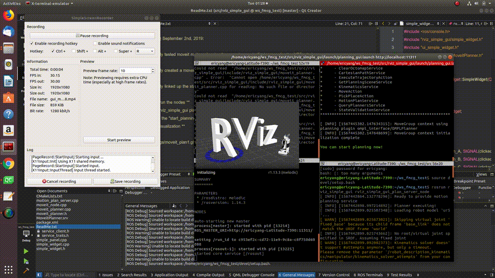
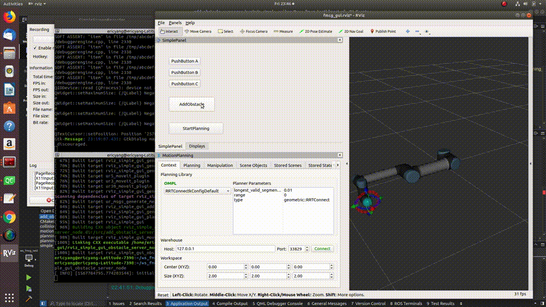

## **FMCG robotics solution pipeline documentation**

#### **QT5 graphical user interface development**
The package utilizes the ui_simple_widget to create a GUI with customizable uis in Rviz.
The developer could add buttons to trigger various processes.

#### **motion planning module utilizing the moveit! c++ api development**
The package contains moveit package for UR5 robot. By combining the moveit cpp API with the QT GUI, the package is able to
trigger motion planning request to the moveit planner, and the planned path will be displayed in the Rviz panel.

commits @ September 2nd, 2019:

Successfully tested moveit motion planning for a random end-effector pose for the UR5 robot.

Successfully created a moveit motion planner ROS service server node and a ROS service client node.

Successfully linked up the start_planning button in the QT GUI with the motion planning service client node.

####** How to run the nodes **
roslaunch rviz_simple_gui planning_gui.launch
Then, click the "start_planning" button to start the planning process.
####** Result visualization **

commits @ September 6th, 2019:

Successfully created a scene obstacle with ros service server

Successfully integrated the add obstacle ros service server with the GUI.

####** How to run the nodes **
roslaunch rviz_simple_gui planning_gui.launch
Then, click the "add_obstacle" button to start the planning process.
####** Result visualization **

